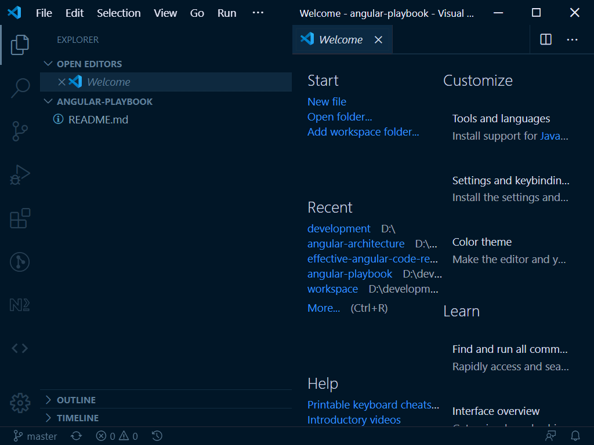

# Getting Started

## Prerequisites

- Node and NPM
- Visual Studio Code
- Angular CLI
- Git

## Visual Studio Code

Install [Visual Studio Code](https://code.visualstudio.com/download).


## Node Setup

You can install a single version of NodeJS on your machine. However, for web development it is much easier to use a Node Version Manager that can load and switch between different versions. 

> Your future self will thank you for doing this.

Use either the Windows or Mac instructions based on your computer.

### Windows Node Version Manager

Download and install [Node Version Manager for Windows](https://github.com/coreybutler/nvm-windows). Verify your installation in a new terminal using the command below.

```ts
nmv list
```

Verify the version of Node that you are running.

```ts
node - v;
```

### Mac Node Version Manager

Use the instructions at [https://github.com/nvm-sh/nvm](https://github.com/nvm-sh/nvm)

## Use/Select Node Version

Each version of Angular will need to use compatible versions of the following tools/packages. 

- Angular CLI
- Node
- NPM
- TypeScript

> Use the following *unofficial* - yet very reliable guidance at: [Angular CLI, Angular, Node.js and TypeScript compatibility.](https://gist.github.com/LayZeeDK/c822cc812f75bb07b7c55d07ba2719b3)

To target Angular 10, we will need to use NodeJS version 12.11.x or later minor version. Use the `nvm` tool to install this version

```ts
nvm install 12.11
```

Here is the output of the installation. To complete our setup

```ts
nvm install 12.11
12.11.0
Downloading node.js version 12.11.0 (64-bit)... 
Complete
Creating C:\Users\matt\AppData\Roaming\nvm\temp

Downloading npm version 6.11.3... Complete
Installing npm v6.11.3...

Installation complete. If you want to use this version, type
nvm use 12.11.0
```

To complete our setup, use the command:

```ts
nvm use 12.11.0
```

## Yarn or NPM

Install Yarn.

```ts
yarn - v;
```

## Angular CLI

When you want to target a specific version of Angular (not latest), you can view the versions of the Angular CLI at [https://www.npmjs.com/package/@angular/cli](https://www.npmjs.com/package/@angular/cli). 

> Use the list to view the latest version of the target *major* and *minor* number. For
> example if we want to use Angular version 10, the latest version is `10.2.0`. We can
> install this version using the command: `npm i @angular/cli@10.2.0`

```ts
npm i -g @angular/cli@10.2.0
```

Use the `ng --version` command in your terminal to verify the installation and to see the version information.

```ts
ng --version

     _                      _                 ____ _     ___
    / \   _ __   __ _ _   _| | __ _ _ __     / ___| |   |_ _|
   / △ \ | '_ \ / _` | | | | |/ _` | '__|   | |   | |    | |
  / ___ \| | | | (_| | |_| | | (_| | |      | |___| |___ | |
 /_/   \_\_| |_|\__, |\__,_|_|\__,_|_|       \____|_____|___|
                |___/
    

Angular CLI: 10.2.0
Node: 12.15.0
OS: win32 x64

Angular:
...
Ivy Workspace:

Package                      Version
------------------------------------------------------
@angular-devkit/architect    0.1002.0 (cli-only)
@angular-devkit/core         10.2.0 (cli-only)
@angular-devkit/schematics   10.2.0 (cli-only)
@schematics/angular          10.2.0 (cli-only)
@schematics/update           0.1002.0 (cli-only)
```

## Angular Upgrades
 
Get information about Angular [versions/releases](https://angular.io/guide/releases). There is an Update Guide tht provides help to upgrade to newer versions of Angular. See: [https://update.angular.io/](https://update.angular.io/)

For example, if you want to [upgrade from version 8 to version 9](https://update.angular.io/#8.0:9.0), you can use the [guide](https://update.angular.io/#8.0:9.0) for steps.

## Git

Install Git on your machine.

```ts
git version
git version 2.19.1.windows.1
```

Clone the repository.

```ts
git clone https://github.com/buildmotion/learn-angular-in-3-days
```

Use your terminal to change directory to `workspace`.

```ts
cd workspace
```

Use the `code .` command in your terminal to open the directory in Visual Studio Code.

```ts
code .
```


